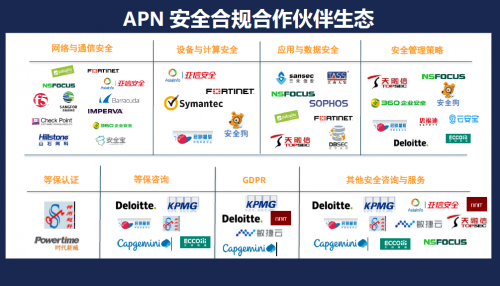
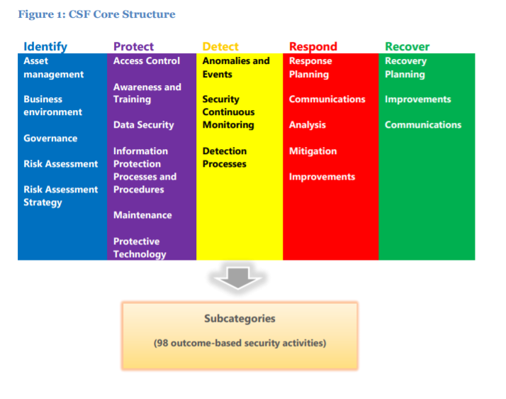
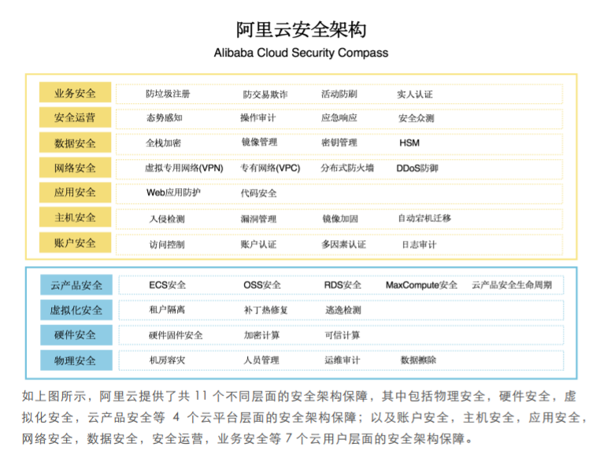
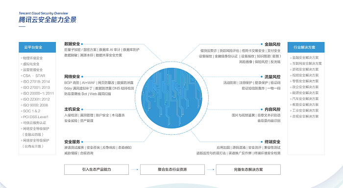
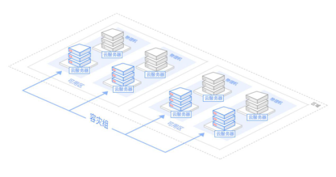
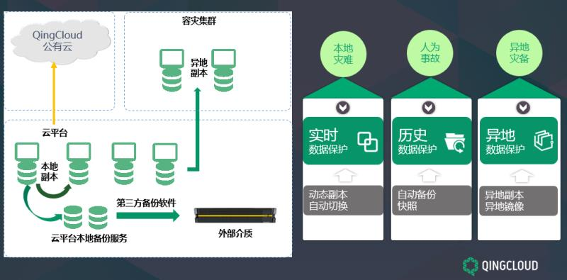

# 调研报告资料整理
## 安全事件
### 2018
##### http://capital.people.com.cn/n1/2018/0816/c405954-30232146.html
* **腾讯云数据丢失事件**
  * 8月5日晚间，“前沿数控技术新媒体”在微博、今日头条、百度等公众平台上发布文章《腾讯云到底安不安全？为什么数据丢了不能恢复？——腾讯云给一家创业公司带来的灾难！》，自述腾讯云硬盘故障导致其公司平台数据全部丢失。
  “前沿数控”是一家于2014年从微信公众号起家的创业公司，定位于数控、模具、机械行业，2016年获得投资后，该公司转型为打造行业的一站式平台，开发了包括网站、H5、小程序产品等。自称是“前沿数控”创始人以及接口人的伍先生告诉《国际金融报》记者，“当时本来是想选择阿里云的，但后来想到有一项短信验证业务在腾讯云办的，一起做便于管理。”万万没有想到的是，这种“把所有鸡蛋放在一个篮子里”的操作，竟让这家公司在数据丢失后一无所有。7月20日晚间，“前沿数据”公司的网站、小程序、H5突然无法打开，且无法登陆云服务器，在向腾讯云后台发起求助后，腾讯云迅速给出了答复：北京三区部分云硬盘出现故障，正在紧急恢复中。之后的两天内，腾讯云处理投诉的负责人向“前沿数控”表示，由于腾讯云硬盘发生的故障导致数据丢失，且几乎没有希望恢复数据，想听取要求赔偿的意见。不过，“前沿数控”的第一需求并非赔偿，而是希望腾讯云尽全力恢复数据。一天后，上述负责人告知“前沿数据”，数据100%找不回来了。“前沿数据”在文章中称，这次事故导致公司近千万元级的平台数据全部丢失，包括经过长期推广导流积累起来的精准注册用户以及内容数据，一瞬间一家创业公司被摧毁了。
  * 8月7日，腾讯云在其官方微信公众号上发布了此次故障的技术复盘。复盘发现，该故障缘起于因磁盘静默错误导致的单副本数据错误，再加上数据迁移过程中的两次不规范的操作，导致云盘的三副本安全机制失效，并最终导致客户数据完整性受损。其运维人员在数据搬迁过程中进行了两项违规操作：
  * 第一是正常数据搬迁流程默认开启数据校验，开启之后可以有效发现并规避源端数据异常，保障搬迁数据正确性，但是运维人员为了加速完成搬迁任务，违规关闭了数据校验。第二是正常数据搬迁完成之后，源仓库数据应保留24小时，用于搬迁异常情况下的数据恢复，但是运维人员为了尽快降低仓库使用率，违规对源仓库进行了数据回收。

##### https://www.iyiou.com/p/78562.html
* **7月24日，腾讯云广州区域部分用户出现资源访问失败、控制台登录异常等情况**。经排查，是因腾讯云广州一区的主备两条运营商网络链路同时中断所导致。实际上主备两条运营商网络链路同时被挖断并不常见。

*  **6月27日，阿里云出现运维失误，导致一些客户访问阿里云官网控制台和使用部分产品功能出现问题**。受影响范围包括阿里云官网控制台，以及MQ、NAS、OSS等产品功能。据悉这次故障被阿里云内部定义为S1级别（在阿里巴巴的线上业务故障级别中，对S1的定义是：核心业务重要功能不可用，影响部分用户，造成一定损失）。

* **4月6日，微软Office 365 和 Azure Active Directory访问出现问题**。

##### http://www.chinacloud.cn/show.aspx?id=27229&cid=29
* **Intel芯片硬件设计缺陷导致安全问题**
  * 2018新年伊始，全球知名硬件厂商英特尔处理器的CPU芯片被爆出在底层硬件设计上存在严重缺陷，并将直接影响到Windows、Linux、MacOS等操作系统，这对于包括亚马逊、微软、谷歌在内的所有云计算厂商而言都构成了致命打击。通过这个漏洞，攻击者可以通过一个虚拟用户，攻击在同一物理空间的其他虚拟用户，而这几大云服务厂商的服务器排列紧密，只要遭到攻击，理论上所有的数据都将遭到破坏。就国内而言，在漏洞披露前，阿里云、西部数码等云计算厂商已与英特尔同步关键安全信息，并持续就修复方案做验证，最迟于北京时间1月15日24点之前完成。

* 近年来，全球因云服务造成的数据泄露事件频频出现。调查数据显示，全球58%的企业在2017年里至少遭遇过一场数据泄露事件。尽管面临安全风险和挑战，但布局“云”成为绝大多数企业的共识，争论焦点已经变成选择何种技术架构、采购哪家云厂商的服务，整个市场正进入爆发阶段。与此同时，如何避免数据泄露，如何管控风险成为企业最关心的话题。

### 2017 
##### 亚信安全 https://www.aqniu.com/news-views/30519.html
##### http://blog.nsfocus.net/public-cloud-security-strategy/
* **2亿美国人的投票数据被暴露**
  * 2017年6月，美国共和党全国委员会承包商——营销公司Deep Root Analytics托管在AWS S3上的数据库泄露，暴露了超过1.98亿美国公民1.1 TB的资料，约占投票人口的61%，泄露的数据包含美国选民的个人信息，如姓名、出生日期、家庭住址、电话号码和选民登记细节，以及针对这些海量数据所做的分析与挖掘，将民主党在2016特朗普选举中的数据运作体系完全暴露了出来。
  * 不知是出于什么脑回路，这些数据库在AWS上被设置为了“公开访问”，只要有个联网的电脑即可通过访问亚马逊子域名“dra-dw”访问到这些机密数据库。民主党大概是贯彻了FBI传授给他们的绝招：最危险的地方就是最安全的地方。所幸，发现这个安全隐患的是UpGuard公司的一名网络风险研究员，他估计也没想到自己这么轻轻松松成了名。如果落到不法分子手里，这么庞大的数据指不定能深度学习出什么信息来危害网络安全。

* **Uber隐瞒5700万账户泄露事件**
  * 2017年11月，Uber主动公开了去年发生了一起严重的数据泄露事件，据悉，黑客通过外部代码托管网站GitHub获得了Uber在AWS上的账号和密码，从而盗取了5700万乘客的姓名、电子邮件和电话号码，以及约60万名美国司机的姓名和驾照号码。为了隐瞒此事件，Uber曾向黑客支付10万美元封口费。

##### http://www.cww.net.cn/article?id=428597
* **Verizon发生数据泄露事故**
  * 2017年7月13日，美国电信公司Verizon发生数据泄露事故，600万客户的姓名、地址、帐户信息（包括帐户个人识别码PIN）可以被公开访问。事故原因是Verizon的第三方服务商错误地配置了亚马逊的Amazon S3的访问权限。 

##### http://www.d1net.com/cloud/security/461878.html
* **亚马逊AWS致S3服务中断**
  * 全球最大的云计算服务提供者亚马逊AWS由于软件工程师的误操作，导致S3服务（简单存储服务）出现中断。简单来说，S3服务是一种高性价比的海量存储服务，企业一旦将应用迁移到AWS云端，基本都会使用这种服务，并且将这一服务与同样由AWS提供的、其他更多的服务关联。S3服务中断，这些关联的服务调用不到数据，也跟着一起遭了殃。运行在AWS上的一大堆互联网应用——包括Expedia、GitLab、GitHub、GroupMe、IFTTT、Medium、Nest、Quora、Slack、The Verge、Trello、Twitch、Wix等也跟着AWS一起下线。

* **50亿条公民信息泄露 京东前员工牵涉其中**
  * 京东50亿条个人信息涉嫌泄露，原因是网络安全部员工监守自盗，与信息安全犯罪团伙合作，将个人信息盗卖给不法分子。虽然这起大案发生在京东自己的IT系统中，但京东同时也是国内公有云服务的主要提供商之一，自家的系统跑在云中——“2016年京东618大促期间，京东云带宽扩容数百G，从容抵挡大量流量瞬间爆增带来的冲击，100%的订单在云上完成。”而与此同时，也为数以万计的企业提供基础设施、平台等不同层级的云服务。

### 2016
##### https://www.alibabacloud.com/zh/notice/error_20161011
* **阿里云华东地域部分服务器故障**
  * 10月11日，阿里云华东1地域可用区B的部分ECS服务器出现IO HANG，导致部分用户无法连接云服务器。这已经不是阿里云第一次出现故障，在去年的5、6月间，阿里云杭州数据中心因光缆中断，导致支付宝访问中断2小时；阿里云香港数据中心因电力故障导致服务瘫痪。

### 2015
##### http://cloud.51cto.com/art/201508/487731.htm
* **Google Compute Engine的Iaas产品出现故障**
  * 2015年2月18日和19日，就在午夜之前谷歌IaaS产品的多个区域出现了故障。在大约1个小时的中断之后，在第二天凌晨1点针对大多数受影响客户的服务恢复正常。一些连接问题持续了大约3个小时，在这期间大约40分钟时间内，由Google Compute Engine虚拟机发送出站的数据包不翼而飞。谷歌表示，这个问题是“不可接受的”，并向受影响的客户道了歉。
  * 3月9日，另一个让谷歌IaaS云瘫痪的网络错误，是三周之前由出站流量中断所导致的。这次故障的原因是一个错误的配置包以谷歌没有预料到的方式给一些服务器造成了影响。服务中断是从美国太平洋标准时间早上10点左右开始，持续了大约45分钟。
  
* **苹果iCloud中断服务**
  *  3月11日，这次故障导致全球有数百万人在长达12个小时内无法购买数字音乐、书籍或者应用。所幸的是，他们大多数人没有受到太大影响。苹果在其道歉中将这次服务中断归咎于一次内部的DNS错误，使得iTunes和苹果商店服务瘫痪。一些iCloud电子邮件帐户也受到短暂影响。
  *  5月20日，包括电子邮件在内的11项苹果服务遭遇了7个小时的中断。一些完全瘫痪了，其他一些只是运行地非常非常缓慢。中断的服务包括iCloud Drive、Photos、Documents、Find My iPhone、Back to My Mac、iCloud Backup、iCloud Keychain、iCloud Mail、iMovie Theater以及iWork for iCloud Beta。根据iCloud的系统状态页面显示，全球5亿iCloud客户中有大约40%受到了影响。

* **微软Azure服务中断**
  * 3月16日，微软有两项Azure公有云服务中断了2个多小时，美国中部客户受到影响，微软称这次故障是“网络基础设施的问题”。这次故障从美国中部时间下午1点开始，影响到微软Azure虚拟机(基础设施即服务)和Azure云服务(平台即服务)产品的客户，微软在其Azure状态网页上面报告了这次故障。微软称这次故障是“部分服务中断”，并表示到美国中部时间下午3:19这项服务已经完全恢复到可用状态。 
  * 3月17日，微软的公有云还没有坚持下24个小时，就发生了第二次故障，虚拟机、网站和其他云服务瘫痪数天时间，这一次影响到了客户更为密集的美国东海岸。微软在其Azure状态页面上报告了这次从美国东部夏季时间下午1:30开始的故障。微软作为全球第二大公有云服务提供商，向客户通知称这次服务故障的根源是存储发生了问题。
 
* **星巴克支付系统故障**
  * 星巴克并不是一家云提供商，但却是云服务的早期采用者，星巴克将自己的CRM系统与POS机产生的客户数据进行了连接。看起来对于云基础设施的依赖性已相当深入，4月24日的一次故障在某种程度上让北美数千个星巴克门店收款机无法使用。当昏昏沉沉的客户希望从无处不在的星巴克那里买一杯傍晚的咖啡时，他们却一无所获。客户数小时无法购买咖啡，一些门店早早就关门了，其他很多门店开始发放免费饮料。星巴克很快就报告称没有故障了——这只是一次由系统日常刷新引发的中断。


### 2014
##### https://www.aqniu.com/news-views/6155.html
* **苹果iCloud安全漏洞泄露名人裸照**
  * 苹果公司一向以其自身设备和服务的安全而自豪，但今年八月，随着其iCloud服务被攻破，许多的名人信息被泄露，这个iPhone和iPad制造商也被狠狠地打了脸。事件造成数百张家喻户晓的名人私密照片被盗，其中包括主演影片《饥饿游戏》（The Hunger Games）的明星詹妮弗·劳伦斯（Jennifer Lawrence）的裸照，苹果公司只好加紧解决其iCloud服务的安全问题。在这么多的企业和个人越来越愿意相信云服务的背景下，该事件向我们敲响了警钟，那就是在云服务上存储敏感文件可能并不像我们想象的那样安全。将敏感资料放在云端，就要对这样的潜在后果有所警醒。很多人可能还不知道，智能手机通常都会自动备份文件到云服务器。今天的设备都非常热衷于将数据推送至各自的云服务器上，人们应该小心敏感资料不会自动上传到网上或者其他配对的设备上。 
  
##### http://www.85kf.com/news/1950.html
* **微软Lync、Exchange服务故障**
  * Lync是微软的即时消息和VoIP服务，也是微软云业务产品Office365套件的一部分，该服务于2014年6月23日在北美洲大部分地区发生中断。微软称这次中断是由“外部网络故障”所导致，部分用户受影响长达8个小时。第二天，Lync继续影响Office 365用户，而微软的托管电子邮件服务Exchange Online也遭遇相同的命运，部分客户电子邮件服务中断长达9个小时。微软表示这次中断与Office 365故障无关。
* **微软Azure中断服务**
  * 2014年8月18日，Azure云在一次作为每月“补丁日”发布的Windows 8.01安全补丁之后导致部分用户中断服务长达5个小时，引发技术问题。微软报告称，Azure服务如虚拟机网站、自动化、备份和站点恢复都在多个地区出现中断。一些分析师抱怨软件巨头微软事后并未对该事件进行完整检查。正如Gartner知名分析师Lydia Leong在Azure 11月这次停机事件之后的抱怨称：“微软无法让Azure服务中断只局限于一个地区，这为很多考虑Azure的企业亮起了红灯。”11月18日的中断事件影响到全球范围内使用各种Azure服务的客户，而这主要是由云存储服务一次性能升级中出现的小故障所导致。 


### 2013
##### https://www.huxiu.com/article/100444
* **Amazon两次宕机损失近700万美元**
  * 亚马逊在2013年8月19日和8月26日发生两次宕机。据推测两次宕机致使Amazon损失了约700万美元。第一次，消费者无法通过Amazon.com、Amazon移动端以及Amazon.ca等网站进行购物。用户登录Amazon网站时，只能看到一条报错信息：“哦，我们非常抱歉，我们在满足你们的需求方面面临难题。请再给我们机会——点击你浏览器上的返回键，再次尝试请求，或者再从我们的主页开始。”几天后，Amazon北弗吉尼亚数据中心在8月26日再一次宕机。据悉，这次的宕机源于网络故障，并持续从美国时间25日下午12时51持续直到下午1时42分。截至下午3时23分，AWS报告说，受影响最大的Elastic Compute Cloud服务已经重新启动和运行。作为世界最大最著名的云计算服务供应商——AWS，很难数清楚有多少的用户因AWS的宕机而受到影响。据《普吉特海湾商业杂志》（Puget Sound Business Journal）估计，若按照亚马逊的每分钟平均销售额11.7882万美元计算，宕机40分钟，亚马逊可能损失了近500万美元的销售额。
  
* **苹果iClould宕机300万用户受影响**
  *  美国太平洋时间2013年8月21日21点30分左右，从苹果的服务状态网页的信息来看，iMessage、Photo Stream、Documents in the Cloud、Backup and Restore和iPhoto Journals等服务都处于无法访问的状态。另外有大约17%的iTunes用户在一个小时时间内无法进行购买操作。服务状态网页称，此次宕机事故而受到影响的用户接近300万人，不到用户总量的1%。苹果并没有对周四的宕机给出任何的解释，而且也没有证据表明苹果的服务遭到恶意攻击。据据业内人士分析此次苹果宕机可能是因为软件错误或设备的功能缺陷导致。此外，在8月28日上午，苹果iTunes Store再次宕机近3个半小时，造成20%用户无法购买媒体内容。苹果系统状态网页显示，该次宕机事故是从太平洋时间早上6:00开始，一直持续到上午9:26，影响到了20%的用户，目前尚不清楚这次宕机原因。
  
* **谷歌全面宕机，5分钟全球流量下降40%**
  * 美国太平洋时间8月16日下午3点50分到3点55分（北京时间8月17日6点50分到6点55分），谷歌遭遇了宕机。此次宕机影响了了包括谷歌网站首页、YouTube视频网站、Google Drive云存储服务以及Gmail邮件服务在内的所有谷歌服务。市场研究公司GoSquared称，Google在5分钟的时间里就让全球的网络流量下降了40%。按照谷歌公布的今年第二季度营收141亿美元的财务情况来推算，此次宕机事件将对谷歌造成约55万美元的损失。但是，谷歌的宕机让人们见识了什么是集群服务器，更让人见识了一个集群服务器的恢复仅仅花了11分钟的时间，这给国内外的互联网企业带来巨大的深思和启发。
  
* **微软Outlook和SkyDrive云存储等服务遭宕机**
  *  2013年8月14日21点左右，微软的邮箱服务Hotmail、即时通讯服务Messenger及云存储服务SkyDrive等在全球范围内出现了技术故障。15日1点20分，微软账户、Messenger及日历已恢复正常，但Outlook邮箱、社交应用People及SkyDrive仍然无法使用，直到美国东部时间8月17日4点30分才基本修复正常。由于Outlook.com的此次宕机导致了一些用户三天未能使用相关的服务，为此，微软还发布声明，向用户致歉，解释了此次宕机的原因以及采取了哪些防范措施来防止未来发生类似情况。


### 2012
##### https://www.wosign.com/news/Dropbox2012.htm
* **知名云存储服务商Dropbox早在2012年就遭到黑客攻击，超过6800万使用者的账户和密码被盗窃**
  * Dropbox已经针对在2012年中旬之前，注册过Dropbox并且此后再也没有修改过密码的用户进行密码重置工作。2012年，Dropbox被黑客攻击了内部系统，并且黑客获得了用户的账户资料，密码泄露也在被黑客取得的资料之中。所以，官方才如此急迫的强制用户修改自己的密码，并且承诺所有在这次事件中受影响的用户，都将在本次密码重置行动中获得保护。
  * 许多用户，都习惯多个网站中使用相同的用户名和密码。尤其是女性用户，几乎是一个账户名和密码走天下。因此，Dropbox的官方建议使用者，不仅要修改Dropbox服务的密 码，也应该考虑是否修改其它网站的密码，从而让自己更加安全。尤其是企业用户，重要的企业敏感内容在上传到网盘时，如果遭到了黑客的窃取，那么将会带来无可估量的损失。 
  

### 2011
##### https://cloud.tencent.com/info/d99eca89b80a0ea6e6acee7a7ce91a89.html
* **谷歌邮箱再次爆发大规模的用户数据泄漏事件。**
  * 2011年3月，谷歌邮箱再次爆发大规模的用户数据泄漏事件，大约有15万Gmail用户在周日早上发现自己的所有邮件和聊天记录被删除，部分用户发现自己的帐户被重置，谷歌表示受到该问题影响的用户约为用户总数的0.08%。
  * 谷歌在Google Apps状态页面表示："部分用户的Google Mail服务已经恢复过来，我们将在近期拿出面向所有用户的解决方案。"它还提醒受影响的用户说："在修复帐户期间，部分用户可能暂时无法登录邮箱服务。"Google过去也曾出现故障，但整个帐户消失却是第一次。在2009年出现最严重的一次故障，有两个半小时服务停顿，许多人当时曾向Google投诉需用这个系统工作。接二连三出错，令全球用户数小时不能收发电邮。Google及微软等科技企业近年大力发展云计算，盼吸引企业客户，但云计算储存多次出事，恐打击用户信心。

* **亚马逊史前最大云计算中心宕机事件**
  * 云计算服务提供商Amazon（亚马逊）公司爆出了史前最大的宕机事件。4月21日凌晨，亚马逊公司在北弗吉尼亚州的云计算中心宕机，这导致包括回答服务Quora、新闻服务Reddit、Hootsuite和位置跟踪服务FourSquare在内的一些网站受到了影响。
  * 这些网站都依靠亚马逊的这个云计算中心提供服务。Quora网站周四上午和下午在英国都无法访问。这个网站完全由亚马逊的EC2（弹性云计算）服务托管，就像FourSquare和许多其它网站一样，亚马逊云服务中断持续将近4天。
  * 根据分析，亚马逊的云计算状态网页目前显示故障发生在北弗吉尼亚州的云计算中心。这个中心为许多Web 2.0公司提供服务。分析人士称，北弗吉尼亚州云计算中心是亚马逊经营的许多云计算中心之一，按照常规，系统的设计之处应用会考虑，一个中心宕机不会中断其它的云计算中心，也不会影响使用那个服务的用户。

  * 此次，亚马逊云计算中心没有绕过北弗吉尼亚州云计算中心的故障把工作量转移到许多其它的云计算中心，令人生疑。服务器宕机，这在人们预想当中，没有那么严重。最简单的，双机热备，一台服务器宕机，另外一台服务器在短时间内可以启动，并不会影响用户的服务。但是，亚马逊的云计算中心这次不同，宕机影响了这么多用户的正常云服务，而且引起用户服务中断的，还是亚马逊引以为傲的弹性云，这对于云计算服务商刚刚建立起来的信任，绝对是一次沉重的打击。经过一番紧急的抢救，亚马逊的云服务恢复了正常。但是，这个事件留给用户的恶劣影响有些深远，用户大呼“伤不起”。
  * 4月30日，亚马逊为宕机事件向用户发表了5700多字的道歉信，声称亚马逊公司已经知道漏洞和设计缺陷所在的地方，它希望通过修复那些漏洞和缺陷提高EC2(亚马逊ElasticComputeCloud服务)的竞争力。亚马逊已经对EC2做了一些修复和调整，并打算在未来几周里扩大部署，以便对所有的服务进行改善，避免类似的事件再度出现。在赔偿方面，亚马逊表示，将向在此次故障中受到影响的用户提供10天服务的点数(Credit)，这些点数将自动充值到受影响的用户帐号当中。但是，对于以后如何避免出现类似事件，并没有提到任何法律上的保证。
  * 亚马逊云服务中断持续了近4天，但是在法律上却没有违反亚马逊EC2服务的服务等级协议（简称SLA）。亚马逊的解释是，亚马逊出现故障的是EBS和RDS服务，而不是EC2服务，从法律上讲，它并没有违反服务等级协议。并且，对于亚马逊提出的应对宕机事件的建议多点备份，仅仅是一个技术规范并非合同保障。这些，似乎都不能给云服务的用户带来信心。


### 2010
##### https://cloud.tencent.com/info/d99eca89b80a0ea6e6acee7a7ce91a89.html
* **微软爆发BPOS服务中断事件。**
  * 2010年9月，微软在美国西部时间周三对在过去几周时间内出现至少三次托管服务中断向用户致歉。这是微软首次爆出重大的云计算数据突破事件。通过使用微软北美设施访问服务的客户可能遇到了问题，故障持续了两个小时。虽然微软工程师解决了这一问题，但是没有解决根本问题，因而又产生了9月3日和9月7日服务再次中断。目前微软有一套RSS反馈系统，当服务受到影响时系统提供故障信息，但有些用户抱怨故障信息太模糊，有时会延迟。寇尔称，微软已经开始对这些故障信息增加更多细节。微软宣布称，微软BPOS(商务办公在线套装软件)中包含的数据已经被非授权用户下载。人们对这种事件的直接反应也许是责怪黑客。但是，这次的事件却与黑客无关。微软的Clint Patterson说，这次数据突破事件是由于微软在美国、欧洲和亚洲的数据中心的一个没有确定的设置错误造成的。BPOS软件中的离线地址簿在"非常特别的情况下"提供给了非授权用户。这个地址簿包含企业的联络人信息。Patterson对于这个错误表示道歉。微软称，这个错误在发现之后两个小时就修复了。微软称，它拥有跟踪设施，使它能够与那些错误地下载这些数据的人取得联系以便清除这些数据。然而，整个事件让那些考虑在明年使用云计算的人感到担心，特别是让考虑使用与Office套装软件捆绑在一起的微软主要云计算产品Office 365的那些人感到担心。
  * 业内人士称，在考虑使用任何厂商的提供的云计算服务的时候，有三个基本的威胁会导致数据泄漏：第一，云计算软件的配置错误或者软件中的瑕疵。第二，黑客窃取数据，为了取乐或者赚钱。第三，员工处理数据的疏忽。


### 2009
##### https://cloud.tencent.com/info/d99eca89b80a0ea6e6acee7a7ce91a89.html
* **Google Gmail邮箱爆发全球性故障**
  * 2009年2月24日，谷歌的Gmail电子邮箱爆发全球性故障，服务中断时间长达4小时。谷歌解释事故的原因：在位于欧洲的数据中心例行性维护之时，有些新的程序代码(会试图把地理相近的数据集中于所有人身上)有些副作用，导致欧洲另一个资料中心过载，于是连锁效应就扩及到其它数据中心接口，最终酿成全球性的断线，导致其他数据中心也无法正常工作。事件过去数日之后，Google宣布针对这一事件，谷歌向企业、政府机构和其他付费GoogleAppsPremier Edition客户提供15天免费服务，补偿服务中断给客户造成的损失，每人合计2.05美元。

* **微软的云计算平台Azure停止运行。**
  * 2009年3月17日，微软的云计算平台Azure停止运行约22个小时。
  * 虽然，微软没有给出详细的故障原因，但有业内人士分析，Azure平台的这次宕机与其中心处理和存储设备故障有关。Azure平台的宕机可能引发微软客户对该云计算机服务平台的安全担忧，也暴露了云计算的一个巨大隐患。不过，当时的Azure尚处于“预测试”阶段，所以出现一些类似问题也是可接受。提前暴露的安全问题，似乎也给微软的Azure团队敲了一次警钟，在云计算平台上，安全是客户最看重的环节。
  * 2010年，Azure平台正式投入商用，成为开发者喜爱的云平台之一。


## 网络文章资料
##### ==2018年第三季度网络安全威胁态势分析与工作综述——中华人民共和国工业和信息化部 2018.12.03== http://www.miit.gov.cn/n1146285/n1146352/n3054355/n3057724/n3057734/c6521880/content.html

##### **云安全的三大隐患和面临的攻击——百度云安全部技术主席王宇** http://cloud.51cto.com/art/201508/488199.htm

##### 中国云计算安全蓝皮书 云平台大规模泄露安全事件频发 http://cloud.idcquan.com/yzx/104735.shtml

##### 公有云比私有云更安全？2017 https://yq.aliyun.com/articles/81776
实际上，在今年2月全球顶级安全行业盛会RSA大会上，传统安全厂商已经意识到这一问题：
以前，全球的安全厂商无一例外地出售包装在“盒子”内的产品和服务；从去年开始，基于 API 接口的云化服务开始冒头；而今年，寻求与云服务提供商合作，提供基于公有云的云安全SaaS服务，成为大部分安全厂商的发展趋势。
此外，今年4月底，Bitglass发布的对3000多名IT专业人士的《Threats Below the Surface》报告中也显示：
IaaS和SaaS安全分别被33％和31％的受访者列为首要投资重点。
公有云的云安全服务受到重视，这对AWS、Azure和阿里云这样全方位的云服务提供商也是个好消息。但是，这样的结论在多数企业用户印象中，却与“私有云比公有云安全”的惯性思维恰恰相反。
私有云数据在防火墙内，客户对数据似乎有着绝对的所有权和控制权，但这并不意味着数据更安全。
对于重要的数据隐私性方面，目前主流公有云提供商都引入第三方硬件加密机（HSM），密钥交与用户，一定程度上消除了数据隐忧。
而在信息安全事件面前，由于目前主流的大型公有云企业自身可能就是超级大用户，他们的应用遭受安全攻击更多，更集中，安全人员的分类也更广更细，在安全“魔高一尺道高一丈”的攻防对峙中，最好的战场总是锻炼出最好的士兵。

##### 云安全现状2018.03 https://cloud.tencent.com/info/d99eca89b80a0ea6e6acee7a7ce91a89.html  
早在2010年5月份，埃森哲与中国电子学会共同发布了一份名为《中国云计算发展的务实之路》的报告。报告指出，安全问题是全球对云计算最大的质疑。而这种担忧在中国尤为突出，"以至于首席信息官们如履薄冰，特别是面对公有云服务时"。

云安全问题一直是全球政府和企业都较为头痛的难题，如果能够跨越这一关，那么，云服务则能够顺利地得到大范围应用，反之则止步不前。所以，可以断定亚马逊宕机事件，将使得其在全球特别是在中国推广云服务业务更加困难。这里，国内很多企业和政府更加相信私有云的安全性。

宕机事件使得人们进一步思考，公有云面临的安全问题。尽管公共云拥有众所周知的成本优势，但是用户不得不提防其存在的安全性、法规遵从和服务质量的隐患。既然数据由第三方托管，客户就希望服务提供商保证数据安全，既不丢失也不被非法访问，遵从法规对存储系统和数据保存位置的要求，并通过网络提供低延迟、高可用的服务。

可以说，不仅仅是云服务，基本所有的互联网服务都逃避不了“安全”问题。既然不能避免，那么，服务提供商只能勇敢面对。未来云服务提供商除了要在云服务架构和技术上不断完善，还要不断为用户提供服务保障体系。

曾经采访国内一家云服务提供商副总裁，他打趣地说：“非常想给公司提供的云服务上一个保险，这样用户数据受到损失，服务出现了问题，可以给用户实实在在的赔偿。”

##### 网络安全事件频发 “云安全”成企业安全配置刚需 2018.09 http://epaper.21jingji.com/html/2018-09/07/content_93230.htm
谈及网络安全，绕不开的一个话题是云安全。如今，企业上云已经不再是新鲜事，但无论是私有云、公有云或者是混合云，将企业数据放到云端究竟是否安全，也成为所有企业非常关心的一个问题。

正因如此，全球范围内正在掀起一场关于云安全的技术热潮。据Gartner预计，到2020年以服务形式交付的安全软件将至少占到50%。还有研究指出，云安全市场规模预计将从2017年的40亿美元增长到2022年的110亿美元，复合年增长率达24%。

包括微软、思科、AWS在内的科技巨头也都意识到了云安全的重要性，并通过收购相关安全公司展开布局；与此同样，传统安全硬件公司和CDN公司也瞄准了这一市场机遇。据不完全统计统计，微软自2014年开始连续收购Hexadite、Adallom、Cloudyn等数家云安全公司；思科则先后花重金将CloudLock、Duo Security等云安全提供商收入囊中。

李东向21世纪经济报道记者表示，全球安全市场正在发生深刻的变革，随着攻击的规模越来越大、攻击手段越来越复杂，云安全将成为云时代企业安全配置刚需，其中自动化和机器学习将成为网络安全解决方案的基石。

而在这场云安全的全球角逐中，传统的CDN公司正发挥极为重要的作用。Imperva、Fortinet、Radware等传统安全硬件公司近年来正通过采取收购CDN公司或者合作的方式，强化其云安全防护能力。

李东认为，“安全公司通过CDN做云安全，是因为随着企业的IT架构逐步上云后，仅仅按照传统硬件的安全防护方式，已经不能有效满足客户的防护需求，因此要用CDN的方式去拓展安全边界。”其还指出，基于CDN的边缘安全，能够有效抵御日益严峻的网络攻击，这在全球产业界已形成高度统一的认知。

如今，数据的价值已经被充分认知，可预见的是，围绕数据领域的网络安全事件也会越来越多，且影响的范围越来越大。周鸿祎表示，安全，未来将是一个整体战。“某一个互联网公司被脱库，所有人都要去做检查，因为他的用户也可能是你的用户，没准用了一套口令。所以在安全面前没有人可以独善其身、隔岸观火，所有人都可能是受害者。”

##### 国内CSP现状2018.08 http://capital.people.com.cn/n1/2018/0816/c405954-30232146.html
CIC灼识咨询执行董事朱悦在接受《国际金融报》记者采访时表示，不论是面向公众服务的公有云还是主要面向企业的行业（私有）云，一个共同的问题就是如何提升安全防护能力。目前各个运营商、服务提供商以及安全厂商所提的云安全解决方案，大多根据自己企业对云平台安全的理解，结合本企业专长，专注于某一方面的安全。然而，对于用户来说云平台是一个整体，需要构建云平台的整体安全防护体系。

　　在朱悦看来，尽管私有云的安全性和可控性更高，但由于相对公有云而言相似的服务更加昂贵，初创企业在考虑运行成本和规模经济的情况下，往往更倾向于公有云。

　　朱悦认为，无论是公有云还是私有云都不是绝对安全的，对于特定核心数据的备份是必要的。“未来云服务，尤其是公有云会变得更为标准化。中国在个人数据和云计算数据安全领域的立法仍然处于发展阶段，相关法律主要从数据处理合法、用户权利、数据安全和披露等方面对数据保护提出了要求。而参考美国标准 TIA-942《数据中心的通信基础设施标准》从可用性、稳定性和安全性分为四个等级，用户根据需求选择相对应的云服务，在出现故障按标准化的渠道选择应对方案。”

　　那么，公有云是否也要数据灾备呢？

　　朱悦对此解释称，灾备是指容灾和备份，是指通过建立多套相同的IT系统互相监视切换或者通过异地备份的方式来增加数据的安全性。通常来说，任何形式的云服务都应有相应的灾备来增加数据安全性。中国公有云目前的灾备仍在发展当中，还没有形成相应标准化的解决方案和灾备评级，以至于企业在选择公有云的时候并没有一个可比的安全性标准。而同时，企业在选择公有云的时候常常处于一个经济效率和弹性需求的考虑，而对于数据安全意识并不强。在公有云被大量运用和数据损失案例频出后，对于数据安全的考虑势必增加，从而反向从企业需求方催生云服务的灾备市场。

　　按照朱悦的说法，==当前的国内公有云市场呈现出四大阵营，以阿里云、腾讯云和百度云为代表的互联网企业阵营;以华为云为代表的IT基础设施厂商阵营;与微软Windows Azure结盟国内运营的世纪互联等国外厂商阵营;最后就是中国电信、中国联通和中国移动所组成的运营商阵营。在市场份额占比当中，阿里云约占市场超过40%的市场份额，紧随阿里云之后的云厂商有腾讯云、华为云、金山云等==。

　　“目前中国公有云市场玩家各有特色，例如阿里云成立之初就是为了解决自己的需求，解决阿里巴巴、淘宝平台商家的需求，而紫光集团旗下的新华三，是企业级市场的巨头玩家，在政务、国企、行业等市场上具有一定的积淀。不过，由于云计算在中国市场尚处于初期阶段，一些中部玩家如金山云、Ucloud、青云QingCloud等，主要是先在游戏云、视频云、金融云等领域建立优势、形成口碑，然后再向其他领域横向拓展，它们也逐渐拥有了自己的市场竞争力，所以未来的市场格局仍然充满变数。”

##### 云服务行业保障缺陷 http://www.cww.net.cn/article?id=428597
当前，以云计算、大数据、人工智能等为代表的新一代信息技术迅猛发展，与各领域、各行业、跨界融合，已经成为创新最活跃、渗透最广泛、影响最深远的新一轮科技革命。我国高度重视云计算发展，发布了《国务院关于促进云计算创新发展培育信息产业新业态的意见》（国发〔2015〕5号）等政策措施。在政府积极引导和企业战略布局等推动下，经过社会各界共同努力，云计算已逐渐被市场认可和接受。“十二五”末期，我国云计算产业规模已达1500亿元人民币，产业发展势头迅猛、创新能力显著增强、服务能力大幅提升、应用范畴不断拓展，已成为提升信息化发展水平、打造数字经济新动能的重要支撑。

在这样的背景下，2017年4月，工信部发布了《云计算发展三年行动计划（2017-2019年）》，目标到2019年，我国云计算产业规模达到4300亿元人民币。不过在云计算产业快速发展的同时也面临诸多问题，除了突破关键技术、业务运行的可靠性，数据安全也是目前企业上云的关注点。

**“堵”不上的数据泄露**

除了宕机事故，数据泄露也是近年来云服务市场发生的恶劣事件。中国信息通信研究院高级工程师封莎接受通信世界全媒体采访时表示，云计算和传统IT系统最显著的区别之一，就是传统IT系统，用户即是服务商，所以对数据安全保护的目标利益是一致的。而在云计算的架构之下，用户和服务商发生了分离，数据的所有者和保管者分离，数据的所有权和保管权分离，这样会必然会引发一些新的问题，主要体现在以下三类，一是传统IT系统的安全问题仍然存在，因为云计算说到底还是信息系统的一种；二是由于不涉及切的利益，云服务商在运营过程中容易忽略，但是会长期潜在的一些未在的安全问题；三是云服务商可能为了自己的利益损害用户数据安全，比如说未经用户同意，将用户数据用来大数据分析、机器学习，或者在用户合同到期后未完全删除用户数据，甚至未经同意将用户数据提供给第三方等。

谈到数据泄露，就不得不提作为全球第一云服务厂商的AWS。目前，亚AWS所提供服务包括：亚马逊弹性计算网云（Amazon EC2）、亚马逊简单储存服务（Amazon S3）、亚马逊简单数据库（Amazon SimpleDB）等。

其中，AWS对外宣传表示，全球使用Amazon S3的网站，已经多达148213 个。而近年来，出现数据泄露问题最多的就是Amazon S3。据相关统计，仅在2017年，就发生多起因Amazon S3造成的数据泄露。2017年6月1日，美国国防部承包商被发现将政府的敏感数据储存在可以公开访问的Amazon S3中。2017年6月21日，美国共和党全国委员会（RNC）合作的数据分析商Deep Root Analytics、TargetPoint以及Data Trust放在Amazon S3的1.1 TB数据发生泄露。其中包含超过1.98亿名美国选民的敏感个人资料，例如姓名、出生日期、住址、电话号码以及选民注册细节信息。2017年7月13日，美国电信公司Verizon发生数据泄露事故，600万客户的姓名、地址、帐户信息（包括帐户个人识别码PIN）可以被公开访问。事故原因是Verizon的第三方服务商错误地配置了亚马逊的Amazon S3的访问权限。

在商业市场，Amazon S3造成的数据泄露引起轩然大波。2017年10月11日，安全公司UpGuard发现全球最大的管理咨询公司埃森哲（Accenture）因亚马逊S3存储服务器配置不当导致大量敏感数据暴露在网上，至少有4台云存储服务器中的数据可供公开下载。暴露的数据包括API数据、身份验证凭证、证书、加密密钥、客户信息，以及能被攻击者用来攻击埃森哲及其客户的其它更多数据。埃森哲客户包含94家《财富》世界100强企业和超过四分之三的《财富》世界500强企业。攻击者可能会利用这些数据对这些跨国企业发起攻击。CSTAR（UpGuard的专有网络风险评分系统）对这起泄露事件的网络风险评分为790（总分950）。

**应完善云服务安全保障制度**

上述才仅是列出AWS一家公司数据泄露的问题，实际上，很多企业都夹在云服务带来的便利以及对云上数据安全的担心之中。

对于云计算的安全问题，我国在《云计算发展三年行动计划（2017-2019年）》中也特意强调要完善云计算网络安全保障制度。贯彻落实《网络安全法》相关规定，推动建立健全云计算相关法律法规和管理制度。加强云计算网络安全防护管理，落实公有云服务安全防护和信息安全管理系统建设要求，完善云计算服务网络安全防护标准。加大公有云服务定级备案、安全评估等工作力度，开展公有云服务网络安全防护检查工作，督促指导云服务企业切实落实网络与信息安全责任，促进安全防护手段落实和能力提升。逐步建立云安全评估认证体系。

另外，应大力推动云计算网络安全技术发展。针对虚拟机逃逸、多租户数据保护等云计算环境下产生的新型安全问题，着力突破云计算平台的关键核心安全技术，强化云计算环境下的安全风险应对。同时，推动云计算安全服务产业发展。支持企业和第三方机构创新云安全服务模式，推动建设基于云计算和大数据的网络安全态势感知预警平台，实现对各类安全事件的及时发现和有效处置。持续面向电信企业、互联网企业、安全企业开展云计算安全领域的网络安全试点示范工作，推动企业加大新兴领域的研发，促进先进技术和经验的推广应用。

对于由云服务提供商造成的数据泄露事故在法律方面如何处理，封莎也表示，目前在法律层面，针对云上数据保护的目前还没有，虽然在《网络安全法》里面会有针对数据安全的法规条例，但是并没有具体涉及到云计算厂商对用户数据的保护应该承担怎样的责任。

也许正因为在云服务的安全制度上尚不完善，因此，目前企业对于云服务的安全评估依赖性逐渐增强。比如，由工信部主导发起、数据中心联盟组织、中国信息通信研究院推出的可信云认证评估，可以云提供商的云产品及服务质量进行测试评估，通过多维度测评，从数据安全、服务质量、服务性能、运维管理和权益保障等多方面进行透析和评价。

来源：《通信世界》杂志3月15日，第7期

## CSPs
#### AWS
* AWS提出安全责任共担模型，集合AWS、AWS客户、APN合作伙伴三方共同做客户的安全。其中，AWS管理和控制云服务所在的物理设施安全，以及托管操作系统和虚拟层的安全，并构建安全的应用。APN合作伙伴提供涵盖网络安全、配置管理、访问控制和数据加密的工具服务。另外AWS在2017年末推出了智能安全服务GuardDuty，打造主动检测和持续性防护能力。



* 在容灾方面，AWS每个可用区具有独立的电源、冷却和物理安全性，并通过运营商的高速光纤网络连接到国家骨干网络。AWS客户可以将其应用程序构建在多个可用区运行，或在两个AWS中国区域分别运行以实现更高的容错。


* AWS安全白皮书 https://aws.amazon.com/cn/whitepapers/

```txt
Design Principles
In the cloud, there are a number of principles that can help you strengthen your
system security:
• Implement a strong identity foundation: Implement the principle
of least privilege and enforce separation of duties with appropriate
authorization for each interaction with your AWS resources. Centralize
privilege management and reduce or even eliminate reliance on longterm credentials.
• Enable traceability: Monitor, alert, and audit actions and changes to
your environment in real time. Integrate logs and metrics with systems to
automatically respond and take action.
• Apply security at all layers: Rather than just focusing on protection
of a single outer layer, apply a defense-in-depth approach with other
security controls. Apply to all layers (e.g., edge network, VPC, subnet,
load balancer, every instance, operating system, and application).
• Automate security best practices: Automated software-based
security mechanisms improve your ability to securely scale more rapidly
and cost effectively. Create secure architectures, including the
implementation of controls that are defined and managed as code in
version-controlled templates.
• Protect data in transit and at rest: Classify your data into sensitivity
levels and use mechanisms, such as encryption, tokenization, and access
control where appropriate.
• Keep people away from data: Create mechanisms and tools to reduce
or eliminate the need for direct access or manual processing of data. This
reduces the risk of loss or modification and human error when handling
sensitive data.
• Prepare for security events: Prepare for an incident by having an
incident management process that aligns to your organizational
requirements. Run incident response simulations and use tools with
automation to increase your speed for detection, investigation, and
recovery.

Security in the cloud is composed of five areas:
1. Identity and access management
2. Detective controls
3. Infrastructure protection
4. Data protection
5. Incident response
The AWS Shared Responsibility Model enables organizations that adopt the
cloud to achieve their security and compliance goals. Because AWS physically
secures the infrastructure that supports our cloud services, as an AWS customer
you can focus on using services to accomplish your goals. The AWS Cloud also
provides greater access to security data and an automated approach to
responding to security events.
```

* NIST Cybersecurity Framework



#### 阿里云
* 阿里云同样提出了安全责任共担模型，阿里云负责云平台基础安全防护，用户负责虚拟化层以上的组件安全、业务安全等。阿里云为用户提供了安全管理、系统安全、业务及内容安全三方面安全能力。安全管理包括云账号安全管理及访问控制、安全审计和远程运维，它们大多源于云产品本身的安全功能；系统安全包括了网络安全、主机安全、应用安全、数据安全、安全态势感知等多方面安全服务。



* 阿里云最知名的安全产品是云盾，云盾在DDoS攻击、OWASP常见攻击都有很好的防御效果，不过在今年3月份的史上首个核弹级DDoS攻击面前，很多阿里云盾的免费用户都遭受了攻击。类似AWS，阿里云也在态势感知方面努力，利用机器学习和威胁情报发现潜在的入侵和高隐蔽性攻击，回溯攻击历史，预测即将发生的安全事件。


* 阿里云安全策略 https://www.leiphone.com/news/201709/vM91sqhnF3eq9xDZ.html
* 阿里云安全白皮书 https://www.alibabacloud.com/help/zh/faq-detail/42435.htm


#### 腾讯云
* 腾讯云是基于“云管端”的体系做安全，腾讯云在数据安全、网络安全、主机安全、安全服务、风控安全、流量安全、内容安全、终端安全的能力方面正在形成布局；同时，腾讯云已联手100多家生态伙伴联防联控，为用户提供云上防御产品和解决方案。



* 另一重要消息是，5月29日，腾讯宣布腾讯贵安七星数据中心正式开启一期试运行。未来贵安七星数据中心将被用于存储腾讯最核心的大数据。按照规划，这将是一座绿色灾备数据中心，会存放30万台服务器。应该说这一数据中心的逐步启用，将有助于数据安全。
* 腾讯云安全白皮书 http://qzonestyle.gtimg.cn/qzone/vas/opensns/res/doc/Qcloud_Security_White_Paper.pdf

#### 金山云
* 金山云从漏洞对抗、业务安全对抗、虚拟化安全对抗和DDoS对抗四个维度来进行布局，希望形成智能的安全平台和可视化的风险数据预警体系。



* 金山云通过提供系统补丁、更新yum源等服务，建立自定义安全组拒绝非信任来源的访问请求，提防系统漏洞带来的黑产入侵。在业务安全对抗方面，主要包括恶意刷单对抗和帐号安全防护。在虚拟化安全对抗方面，金山云通过主机层隔离、租户内网络隔离、租户间网络隔、主机监控和网络监控等方式，来应对虚拟化安全问题。针对用户数据的存储，金山云提供包括对象存储、关系型数据库、Redis数据库等多种存储方式，并加持安全隔离、加密存储、访问控制、隐私保护、数据监控等技术手段保证数据安全。另外结合此前推出的同区域多可用区部署和跨区域VPC对等连接服务，金山云如今可为用户提供同机房、同城、异地三级服务容灾部署能力，为企业级客户打造云上灾备解决方案。

#### 青云QingCloud
* 青云QingCloud组建了网络安全、数据安全、账号安全、高可用的系统架构、应用安全及攻击防范等多方面安全防护。青云QingCloud提供块设备级（block device level）的硬盘备份与恢复， 可以同时对多张硬盘做备份（包括系统盘和数据盘），也可以对正在运行的主机做在线备份。



* 值得一提的是青云QingCloud 在基础网络之外，还提供了私有网络（VxNet）功能。私有网络类似物理世界中的局域网，可保障在公有云多租户的场景下，用户之间100%的二层隔离，这是青云QingCloud在网络安全的布局。


## 文献资料
#### [1] 陈阳. “公有云”与“私有云”的PK[J]. 软件和信息服务, 2010, 卷缺失(12): 90.
* “公有云”是由专门的云服务提供商运营,通过自己的基础架构直接向最终用户提供从应用程序、软件运行环境,到物理基础设施等各种各样的IT资源。
* 私有云”是由企业或机构等单一组织自己来搭建云计算基础架构,面向内部用户或外部客户提供云计算服务。
* “公有云”服务质量更高、资源利用率更高、成本更低、可选择性更多。“私有云”的私密性和安全性则更优。
* “混合云”指兼并“公有云”和“私有云”的部署方式。
* 然未来随着云计算不断成熟、标准框架的真空状态以及数据安全问题逐步解决,“公有云”和“私有云”两种云服务部署模式,就像现在的出租车和私家车一样,这两种模式都是并存的。出租车相当于“公有云”端的云服务,有需求就招一招手,服务完以后就退回去。而私家车相当于“私有云”端的云服务,全力满足个人需要。

#### [2] Beth schultz. 企业云服务的进程[N/OL]. 网络世界. 2011-2-28. http://kns.cnki.net/kns/detail/detail.aspx?FileName=WLSJ201102280281&DbName=CCND2011.
* 用户通过 Web 浏览器或其他简单的前端界面访问所需要的应用程序、基础设施或平台。使用过程中，用户可以随意获取或释放计算资源，并根据计算资源使用情况支付费用。目前被普遍接受的服务模式有三种，部署模式有四种。三种服务模式分别为:软件即服务(Saa S)、基础设施即服务(IaaS)和平台即服务(Paa S)。四种部署模式分别为:私有云、公有云、混合云和社区云。 


#### [3] Beth schuitz. 公有云安全  依然任重而道远[N/OL]. 网络世界. 2011-11-28. http://kns.cnki.net/kcms/detail/detail.aspx?dbname=CCND2011&filename=WLSJ201111280420&dbcode=CCND
* 对公有云的安全疑虑主要集中在以下四个方面：        
  * 对多租户虚拟网络中通信渠道安全的疑虑;
  * 对于如何在云计算中为大量不同类型的移动设备提供安全支持的不确定性;
  * 企业在转向云计算时所使用的扩展现有身份认证和访问控制机制的路径不一致;
  * 如何调整受信任的加密和标记化模型才能充分保护存储在公有云上的敏感数据。
* 据 Aberdeen 集团今年 7 月下旬出版的研究材料显示，在接受调查的 110 个企业 IT 部门中，近半数表示他们采取了向云服务提供商施压的办法，来迫使他们执行更为严格的安全措施。同时，当云服务提供商的安全措施存在不足时，他们也会通过企业所能使用的技术强化这些安全措施。Aberdeen 集团的 Derek Brink 将这份研究材料称为“安全与云的最佳实践”。 
* 企业策略集团首席分析师 Jon Oltsik 称：“现阶段，被企业信任的公有云数量非常有限，但不信任并不能表示公有云的安全性差。”以亚马逊为例，Oltsik 认为亚马逊做了大量的工作，如在其EC2 基础设施中整合安全机制，取得所有适用的认证，以及雇用许多天才的安全专业人员等。目前亚马逊已经拥有了 500 多项安全控制，这从一定程度上来说能够让企业客户感到满意。
* 前 Citrix 首席技术官 Simon Crosby 表示，今天提出的法律与遵从方面的担忧都是十年前“如何执行计算”的残留物。Crosby 目前的身份是新兴公司 Bromium 的创始人，该公司的主要业务是通过使用虚拟化技术研发出确保移动客户安全的产品。Crosby 称，实际上，目前的公有云结构比任何私有网络更能抵御住攻击。    Crosby 补充道：“如果你让我创建一个安全的应用，并要求这个应用必须全天 24 小时运行且没有数据被窃的隐患，那么我会创建一个类似 Netflix 的东西，并让他们在亚马逊公有云上运行。亚马逊公有云相当分散，因此能够抵御任何形式的大规模匿名 DDoS 攻击，同时我们也就不会丢失任何数据。”据 IDC安全产品项目经理 Phil Hochmuth 于 8 月份撰写的云安全研究报告显示，当用户被问及他们是否认为云服务提供商的架构比他们的内网更加安全时，接受调查的 500 家公司中，仅有三分之一的受访者表示肯定。但在那些已经部署了公有云或混合云的公司中，超过半数的受访者认为供应商比他们各自的 IT 团队更安全。 
* 云安全联盟(CSA)目前也正在关注云提供商的 STAR 注册问题。CSA 是一个中立的行业团体，一直以来持续关注云安全问题并受到越来越多的信任。CSA 曾编辑发布了一份有关云安全最佳举措的指导文件，在厂商和客户之间引起了很大的反响。CSA  常务董事 Jim  Reavis 称：“在数据安全和信息公开之间有一个合理的折衷点，这也是STAR 注册的出发点。”  CSA 会要求云服务提供商回答 200 多个问题，诸如遵从性、数据控制、物理安全、人力资源安全、信息安全、法律需求、风险管理、发布管理、复原力和安全架构等。尽管如此，问题仍然存在。但又有多少云服务提供商愿意透露这些必要的信息呢?
* 位于加州斯科茨谷的 Catbird  网络总部是一家专业从事虚拟安全的公司。该公司首席技术官Michael  Berman 表示，能够推动大型公有云提供商进行安全评估的客户数量仍然为数不多。而Catbird 的主要工作是与企业客户一起保护客户的私有云。目前该公司也与亚马逊展开了合作，为亚马逊的公有云提供安全服务。Berman 称：“亚马逊通过提供 CPU、带宽和存储挣了许多钱，但亚马逊并不对存储在其云服务上的敏感数据承担任何负责。而就目前的经济环境来看，亚马逊并不打算改变这种做法。”==CSP也无法保证云端数据存储的安全性，也选择将安全服务外包给安全公司==

#### [4]（自行翻译）Kui ren,Cong wang,Qian wang,等. Security Challenges for the Public Cloud[Z]. 2012
* CSP cloud service provider 云服务提供商
* 云计算有极大的优点，但是安全性和隐私性是其广泛应用的首要阻碍。CSPs将剥夺了用户的管理权，将管理权赋予商业化的公有云服务，使得用户不能直接管理自己的数据和应用。相比于个人的计算设备，尽管CSPs的基础设备和管理容量更加强大和可靠，云平台依旧面临着内、外部和隐私的威胁，包括介质失效、软件漏洞、恶意软件、管理员失误和内部恶意人员等。==事件：Apple iPad用户隐私泄露，Amazon S3（亚马逊提供的云存储服务）停机故障，Gmail大量的邮件丢失。==
* 因为用户无法接触到云内部的操作细节，CSPs可以任意地检查用户数据而不会被发觉。此外，因为硬件虚拟化，多个用户现在可以共享相同的物理基础设备，同时运行各自不同的应用程序实例。尽管这样提高了资源的利用率，但是这种独特的多用户的特性也为用户交互引发了新的安全性和隐私性的漏洞。因此，从用户的角度来看，云本质上是不安全的。如果不能提供强大的安全和隐私保障，我们就不能指望用户仅仅因为经济实惠和服务灵活就将自己的数据和应用的控制权移交给云平台。
* 在这里，我们概述了几个关键的安全挑战，指出了它们的重要性，并激励进一步调查安全解决方案，这将有助于可信赖的公共云环境成为现实。

* 数据服务外包安全
  * 随着个人和企业产生越来越多的必须存储和利用的数据（电子邮件，个人健康记录，相册，税务文件，金融交易等），他们倾向于将本地复杂的数据管理系统外包给具有更大的灵活性和成本较低的云服务厂商。但是，一旦用户不再拥有自己的数据，数据的机密性和完整性就会受到威胁。

  * 对于前者而言，外包之前将数据加密是保护数据隐私和在云及其他服务抵抗未经请求的访问的最简单方法。但加密使得部署传统数据利用服务（例如明文关键字搜索文本数据或查询数据库）成为一项艰巨的任务。由于云规模系统带来的巨大带宽成本，下载所有数据并在本地解密它的简单解决方案显然是不切实际的。此外，除了消除本地存储管理之外，在云中存储数据没有任何意义，除非人们可以轻松搜索和利用该数据。==理解：就是说直接加密存储是不现实的，在云端的加密数据无法被检索和使用，那么云端存储就仅仅是存储数据，完全比不上本地数据存取==
 
  * 关于如何搜索加密数据的这个问题最近引起了关注，并导致了可搜索加密技术的发展。在较高的层次上，可搜索的加密方案采用预先构建的加密搜索索引，允许具有许可的用户通过关键字安全地搜索加密数据，而无需先对其进行解密。但是，考虑到潜在的大量按需数据用户和云中的大量外包数据文件，这个问题仍然特别具有挑战性，因为满足效率，系统可用性和可扩展性要求是非常困难的。在这种情况下，众多有趣但具有挑战性的问题仍然存在，包括对加密数据的相似性搜索，对加密数据的安全排名搜索，安全的多关键字语义搜索，安全范围查询，甚至对非文本数据（如图形或数字数据）的安全搜索。==理解：为解决上面一个问题，可搜索的加密技术得到了发展，就是说用户无需解密就可搜索到所需数据，依然存在安全性和高效性的问题==

  * 将数据服务外包给云时出现的另一个重要问题是保护数据完整性和长期存储的正确性。虽然将数据外包到云对于长期大规模存储具有成本较低的优势，但它并不能完全保证数据的完整性和可用性。如果不妥善解决此问题，可能会阻碍云架构的成功部署。鉴于用户不再在本地拥有他们的数据，他们不能利用传统的加密原语来保护其正确性。这些原语通常需要数据的本地副本以进行完整性验证，这在外包存储时是不可行的。此外，大量的云数据和用户的受限的计算能力使得在云环境中的数据正确性审计变得昂贵且甚至代价是巨大的。因此，启用统一存储审计架构对于这个新兴的云经济完全建立非常重要;用户需要采用各种方法来评估风险并获得对云的信任。从系统可用性的角度来看，这样的设计应该在计算和带宽方面产生非常有限的审计开销，结合云数据的动态特性，并在引入专门的第三方审计员时保护用户的隐私。==理解：为了保证数据长期存储的完整性和可用性，在云数据庞大的数量以及受限的云计算能力的压力下，云服务提供商是无法保证这个问题的，因此必须引入统一的第三方存储审计架构来评估存储能力、风险、保护用户隐私==

  * 除存储正确性外，还会出现与云存储服务相关的其他安全问题。一个值得注意的安全概念是所有权证明。该技术旨在防止通过跨用户重复数据删除产生的侧信道暴露用户数据，这是广泛用于节省CSP所需的空间和带宽。其他具有挑战性的安全问题包括确保数据删除和容错的远程评估，即远程检测云中的硬盘驱动器故障漏洞。

* 计算外包安全
  * 云范式中启用的另一项基本服务是计算外包。通过将工作负载外包到云，用户的计算能力不再受其资源和设备的限制。相反，他们可以按照按使用付费的方式享受云的无限计算资源，而无需在本地投入任何大量资本支出。

  * 然而，当前的外包实践以++明文++形式运行。也就是说，它向商业公共云揭示了数据和计算结果。这可能引发很大的安全问题，特别是当外包计算工作负载包含敏感信息时，例如企业的财务记录，专有研究数据，甚至是个人身份识别的健康信息。此外，云的运营细节对用户来说不够透明。因此，各种动机可能导致云表现不正常并返回不正确的结果。这些范围从可能的软件错误，硬件故障，甚至是局外人攻击到云服务器故意“懒惰”以节省计算成本。因此，我们非常需要安全的计算外包机制来保护敏感的工作负载信息并确保从云返回的计算结果是正确的。然而，由于机构设计必须同时满足的若干挑战，这项任务很困难。首先，就计算复杂性而言，这种机制必须是实际可行的。否则，用户的成本可能变得非常大，或者云可能无法在合理的时间内完成外包计算。其次，它必须在不限制系统假设的情况下提供合理的安全保障。也就是说，它应该在安全保障和实际效率之间取得良好的平衡。第三，与在本地解决问题所需的工作量相比，该机制必须能够为用户实现大量的计算节省。否则，用户没有理由将计算外包给云。

  * ==完全同态加密（FHE）的最新突破表明，安全计算外包的一般结果在理论上是可行的==。但是，由于FHE操作极其复杂，在实践中尚无法处理，因此将这种通用机制应用于日常计算任务仍远未实用。

* 访问控制
  * 在许多应用场景中，例如企业或组织中的场景，用户对数据的访问通常具有选择性和高度差异性。不同的用户享有关于数据的不同访问权限。当数据外包到云时，在大量用户之间实施安全，高效和可靠的数据访问至关重要。

  * 传统上，为了控制隐私敏感数据的传播，用户建立一个可信服务器以在本地存储数据，然后控制该服务器以检查请求用户是否在让他们访问数据之前提供正确的身份认证。从安全角度来看，当我们将数据外包给云时，这种访问控制架构已不再适用。由于数据用户和云服务器没有在同一可信域，服务器可能不再被完全信任作为一个无所不知的检测器和执行访问控制策略和管理用户的详细信息的地方。如果服务器受到攻击或潜在的内部攻击，用户的私人数据甚至可能会被暴露。==理解：云服务器并不是数据用户的可信服务器，如果服务器收到攻击或内部存在漏洞，用户的私人数据可能会被暴露。==

  * 在不依赖于云服务器的情况下实施数据访问的一种可能方法，可以是以差异化方式加密数据并且仅向授权用户公开相应的解密密钥。然而，这种方法通常会遇到严重的性能问题，并且无法扩展，尤其是当潜在的大量按需用户需要细粒度的数据访问控制时。研究人员一直在研究如何实现一种完全利用云计算资源丰富性的细粒度访问控制设计。通过这种方法，数据用户将能够安全地将最繁琐的用户数据管理工作负载委托给云。例如在大型动态系统中处理频繁的用户访问权限更新，同时仍然保留基础数据机密性以防止任何未经授权的访问。

* 值得信赖的服务计量
  * ==随着计算即服务的普及，用户将云资源用作公共实用程序来完成其任务。为了使服务有利可图，CSP根据用户所消耗的资源向用户收费。例如，Amazon Elastic Compute Cloud（EC2）根据用户指定的EC2实例处于运行状态的时间向用户收费，而Google AppEngine则根据用户应用程序消耗的CPU周期数收取费用。但是，由于用户可能对云基础架构几乎没有或根本没有可见性，因此他们通常无法直接连接其实际的云资源消耗和使用费用。例如，虽然硬件虚拟化允许多个用户在同一基础架构上运行任务而不会明显相互干扰，但许多共享资源（如内存，I / O和网络带宽）无法完全隔离。因此，当真正的罪魁祸首可能是由于在同一物理基础架构上运行任务的其他用户导致的软件错误或网络拥塞时，CSP可能会错误地将意外成本应用于用户的使用情况报告。==

  * 因此，如果要使基于效用的计算范例获得成功，如何保证服务计量的可信度至关重要。非常需要一种安全公平地测量资源消耗的统一机制，这将有利于云用户和CSP。首先，一个值得信赖的服务计量机制将允许用户获得他们实际消耗的云资源量的可验证保证，从而帮助他们更容易地信任云。其次，这种机制可以作为解决云用户和CSP之间任何未解决的收费纠纷的不可或缺的仲裁手段。第三，无偏见和独立的服务审计员可以进一步采用这种机制来审计和量化CSP在其服务级别协议中承诺的服务质量，确保面向公用事业计算的服务模型是经济的。最后，值得信赖的服务计量将鼓励更多的云采用，从而提高CSP的收入，因为整体资源利用率得到提高。

* 多用户安全和隐私
  * 多用户是云计算的基本属性。为了优化资源利用率，CSP通常使用硬件虚拟化来隐藏计算平台的物理特性。这使得多个用户可以在同一物理基础架构上同时运行其不同的应用程序实例，而无需查看彼此的数据。多用户增加了对底层硬件资源的使用，并且通过虚拟化，减轻了CSP的管理负担，允许高效且有效的资源配置和重新分配，而无需任何前期硬件购买或设置。

  * 尽管有其优势，但这种多用户云环境还为云基础架构和云用户带来了严重的安全威胁和隐私漏洞。虚拟化环境与物理环境中的现有操作系统和应用程序共享相似的功能，因此这些系统中的软件错误和新发现的安全漏洞仍然是任何虚拟化多用户环境的主要威胁。考虑到云系统的规模，与非虚拟化计算环境相比，这些安全风险的潜在威胁可能更大。此外，对于云中的资源管理，必须在多个物理机之间不断地提供，分配或甚至迁移不同的虚拟化应用程序实例。

  * 多用户也为潜在的隐私泄露打开了大门。如前所述，侧通道攻击在多租户环境中为云用户的信息带来了新的风险。==在最近的一项研究中，研究人员使用工程技术从CSP推断出虚拟化资源分配策略，并成功将其虚拟化应用程序实例放在与目标受害者相同的物理机器上。然后，他们能够通过流量模式和其他旁道信息提取受害者的私人信息。==这些结果表明，即使在强烈孤立的多用户环境中，这种新型的隐私泄露仍然是一种可能的威胁。

  * 多用户安全和隐私是公共云的关键挑战之一，如果要广泛采用云，寻找解决方案至关重要。但是，目前几乎没有什么工作能够解决这些问题，而且能够始终如一地保持这种动态计算环境的可扩展性。

* 安全开销等
  * 虽然在云中设计安全性会使用户和CSP受益，但它不可避免地增加了两者的开销。特别是对于用户而言，此类开销可能会抵消云的经济吸引力，并可能与他们首先使用云的目的相冲突。如何定量探索安全开销和云优势之间的权衡是另一个有趣但重要的问题。此问题的任何解决方案都将帮助用户在迁移到云之前做出更明智的决策。

  * 我们已经描述了商业公共云的几个关键安全挑战，但我们的列举并不全面。例如，虽然云计算在降低成本的同时提供了无限的计算能力，但==如何防止恶意云用户滥用云资源仍然是一个问题。此类滥用可能包括密码/密钥破解，恶意数据托管或僵尸网络命令和控制。==采用更严格的云资源使用监控可能是缓解这种担忧的一种方法，但它不可避免地与合法用户的隐私权相冲突。因此，需要进行新的研究。

* 安全和隐私是云计算成功的一个根本障碍。在此背景下，我们讨论了当前研究重点尚未解决的几个关键安全挑战。本文旨在呼吁采取行动，以激励进一步调查将影响公共云未来的许多具有挑战性的安全问题。显然，要使可信赖的公共云环境成为现实，仍有许多工作要做。


#### [5]王宇. 基于数据安全和隐私保护的移动云存储系统的设计和实现[D]: 电子科技大学, 2018.
* 移动云存储
  * 移动云存储是在云存储技术的基础上结合移动互联网发展而来的，通过移动终端和云存储服务相结合，利用通信网络将终端的数据存储在云存储服务器，给用户提供的数据存储和数据访问服务。移动云存储作为云存储技术在移动终端的应用，成功解决了移动终端处理能力低、存储能力不足问题，具有可拓展性强、可用性高、便携性强等特点，正在被广泛应用。 
  * 然而，现有移动云存储模型的数据机密性是由云服务商提供的，依托于云服务商是可信赖的前提，存在云存储商主动或恶意泄露用户数据的可能。因此，传统的移动云存储系统存在数据安全和隐私保护隐患。本文在总结传统移动云存储系统存在安全隐患的背景下，提出以多云存储为架构的新型移动云存储系统。本系统利用数据分块、数据加密将用户数据分块加密并存储在多个云存储端，以消除由于依赖某一个云服务商而产生数据泄露的安全性问题。 
* 云存储
  * 云存储是利用云计算技术发展起来的新型网络存储形式，利用大量便宜的存储设备通过分布式、集群和网格技术进行统一组织、管理，共同提供在线存储、在线访问的数据存储服务。  

